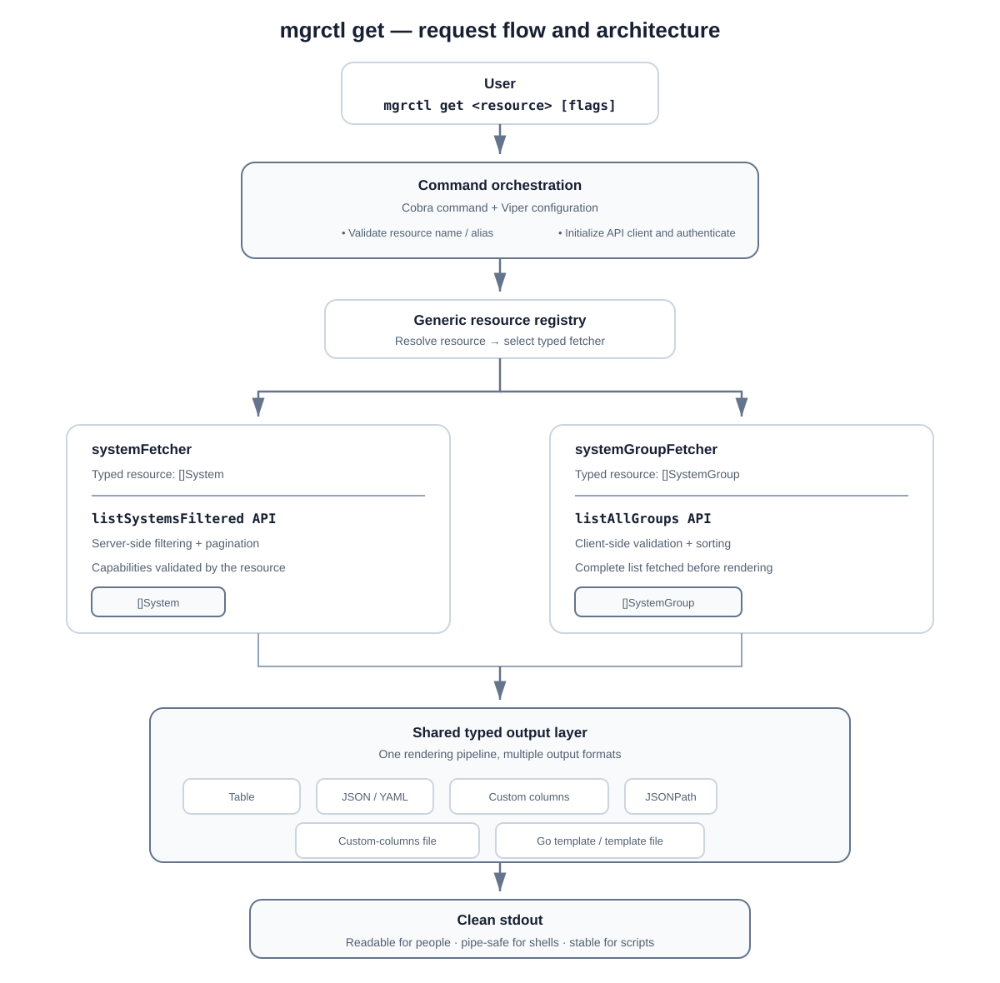

# Google Summer of Code Final Report

## Extending `mgrctl` with a reusable, script-friendly `get` command

**Contributor:** Jay Prakash Katara (GitHub: [@katara-Jayprakash](https://github.com/katara-Jayprakash))  
**Organization:** [Uyuni Project](https://www.uyuni-project.org/)  
**Project repository:** [uyuni-project/uyuni-tools](https://github.com/uyuni-project/uyuni-tools)  
**Primary contribution:** [Pull Request #789](https://github.com/uyuni-project/uyuni-tools/pull/789)  
**GSoC year:** 2026  
**Official project title:** Introducing a kubectl-like `get` command for Uyuni's `mgrctl`  
**Mentors:** Cédric Bosdonnat, Michele Bussolotto, and Marvin  
**College:** G.L. Bajaj Group of Institutions, 2023-2027

## Table of contents

- [Abstract](#abstract)
- [About me](#about-me)
- [About Uyuni and `uyuni-tools`](#about-uyuni-and-uyuni-tools)
- [Problem statement](#problem-statement)
- [Goals](#goals)
- [Architecture at a glance](#architecture-at-a-glance)
- [How the command works](#how-the-command-works)
  - [Step 1: reading the command](#step-1-reading-the-command)
  - [Step 2: finding the resource implementation](#step-2-finding-the-resource-implementation)
  - [Step 3: preparing the system filter](#step-3-preparing-the-system-filter)
  - [Step 4: calling the Uyuni API](#step-4-calling-the-uyuni-api)
  - [Step 5: printing the result](#step-5-printing-the-result)
  - [System groups use the same path](#system-groups-use-the-same-path)
- [Testing and quality](#testing-and-quality)
- [Tested commands](#tested-commands)
- [Development process](#development-process)
- [Challenges and how I solved them](#challenges-and-how-i-solved-them)
  - [Heterogeneous resources with Go generics](#heterogeneous-resources-with-go-generics)
  - [Clean output versus logging](#clean-output-versus-logging)
  - [Different API capabilities](#different-api-capabilities)
  - [Flexible formatting without losing numeric precision](#flexible-formatting-without-losing-numeric-precision)
  - [Designing useful help for future growth](#designing-useful-help-for-future-growth)
- [Results and impact](#results-and-impact)
- [What I learned](#what-i-learned)
  - [Technical learning](#technical-learning)
  - [Personal growth](#personal-growth)
- [Acknowledgements](#acknowledgements)
- [References](#references)

## Abstract

During Google Summer of Code, I worked on `mgrctl`, the command-line tool used to manage Uyuni servers mainly through the Uyuni API. My contribution introduces a new `mgrctl get` command family for retrieving Uyuni resources in a consistent, discoverable, and automation-friendly way.

My first implementation was much simpler: the command knew about systems directly. That worked for the first resource, but when I started adding system groups, I could already see the duplication coming. That was the point where I moved resource-specific logic behind fetchers and added the registry.

The command can now list systems and system groups, validate resource-specific operations, support server-side pagination and filtering where the API permits them, sort system groups locally, and render results as tables, JSON, YAML, custom columns, JSONPath, or Go templates.

## About me

I am Jay Prakash Katara, an open-source contributor interested in backend engineering, command-line tools, APIs, and systems management. This project gave me practical experience working with Go and responding to feedback from Uyuni maintainers.

My contribution profile is available on [GitHub](https://github.com/katara-Jayprakash). During this project, I worked most closely with Go, Cobra, Viper, REST-style Uyuni API calls, reflection, generics, JSONPath, Go templates, localization, unit testing, Git, and GitHub's review workflow.

## About Uyuni and `uyuni-tools`

[Uyuni](https://www.uyuni-project.org/) is an open-source configuration and infrastructure management solution for software-defined infrastructure. It helps administrators manage software, configuration, and systems across their infrastructure.

The [`uyuni-tools`](https://github.com/uyuni-project/uyuni-tools) repository contains three Go command-line applications:

- `mgradm`, for administering containerized Uyuni servers;
- `mgrpxy`, for managing Uyuni proxies; and
- `mgrctl`, for managing Uyuni servers mainly through their API.

My work focused on `mgrctl` and on shared output utilities that can be reused by other commands.

## Problem statement

Before this work, `mgrctl` did not provide a general, resource-oriented command comparable to tools such as `kubectl get`. A user who wanted to inspect registered systems had to use lower-level API-oriented commands or another interface and then manually process the response.

In practice, users did not have a simple `get <resource>` command for this work. The API response was also not easy to read in a terminal, and scripts had to handle the raw output themselves. A useful command needed to provide tables for people and clean JSON, YAML, selected columns, or templates for scripts. It also needed to be designed so that adding another resource would not mean copying the API calls, help text, validation, and output code all over again.

The core challenge was therefore not only to list systems, but to design a foundation that could support additional Uyuni resources without turning `mgrctl get` into a large resource-specific switch statement.

Setting up a Uyuni server for testing was another practical challenge. Running the full environment locally on macOS was difficult, so I used a Uyuni server on Google Cloud for development and live testing. That setup gave me a working environment in which I could test the commands against a real API.

## Goals

The implemented work addresses the following goals:

- Add `mgrctl get` as a top-level command group.
- Add typed support for the `system` resource and its `sys` alias.
- Add typed support for the `systemgroup` resource and its `grp` alias.
- Use the Uyuni API to fetch real resource data.
- Support pagination and filtering for systems.
- Support client-side sorting for system groups.
- Provide human-readable and machine-readable output formats.
- Keep standard output clean so JSON, YAML, and templates can be piped to other programs.
- Make new resource types easy to register.
- Provide useful, localized help and error messages.
- Add unit tests for parsing, registration, lookup, formatting, sorting, validation, and edge cases.

## Architecture at a glance

This diagram shows how a `mgrctl get` request moves through the command, resource registry, API fetcher, and output layer.



## How the command works

The easiest way to explain the design is to follow a real command from beginning to end. Consider this example:

```bash
mgrctl get system \
  --filter 'server_name=uyuni.demo.local' \
  --page 0 \
  --page-size 10 \
  -o custom-columns=ID:ID,NAME:Name
```

The user is asking `mgrctl` to find a system called `uyuni.demo.local`, return the first page, and print only its ID and name.

### Step 1: reading the command

The command starts in `mgrctl/cmd/get/get.go`. Cobra reads `system` as the resource name and parses the filter, page, page size, and output flags.

These values are collected in one `ListOptions` value. At this point, the command does not know how systems are fetched or which API endpoint they use. It only knows what the user requested.

The command then passes those options to the selected resource:

```go
return resource.ListAndPrint(client, ListOptions{
    Filter:       flags.Filter,
    PageNumber:   flags.Page.Number,
    PageSize:     flags.Page.Size,
    OutputFormat: flags.OutputFormat,
    Out:          os.Stdout,
})
```

The same file also initializes the existing Uyuni API client. If a username and password were supplied, the client logs in and stores the returned session cookie for the following requests.

### Step 2: finding the resource implementation

The command then looks up `system` in the registry defined in `mgrctl/cmd/get/resource.go`.

The registry connects a command-line name to the code that knows how to fetch that resource. It currently contains:

```text
system       alias: sys
systemgroup  alias: grp
```

This means `mgrctl get system` and `mgrctl get sys` follow the same path.

I used a registry because I did not want the main command to contain code like:

```go
if resource == "system" {
    // fetch systems
} else if resource == "systemgroup" {
    // fetch system groups
}
```

That approach becomes harder to maintain every time a resource is added. With the registry, a future resource only needs its own fetcher, columns, help text, name, and aliases.

Each fetcher still works with its real Go type. A system fetcher returns `[]System`, while a system-group fetcher returns `[]SystemGroup`. The generic interface keeps those types intact, and the registry wraps the fetcher so the main command can call it without knowing the concrete type in advance.

The registration itself is small:

```go
registerResource [System] ("system", &systemFetcher{}, []string{"sys"})
registerResource [SystemGroup] ("systemgroup", &systemGroupFetcher{}, []string{"grp"})
```

### Step 3: preparing the system filter

Because the selected resource is `system`, execution continues in `mgrctl/cmd/get/system.go`.

The filter:

```text
server_name=uyuni.demo.local
```

is separated into:

```text
filter key:   server_name
filter value: =uyuni.demo.local
```

Before making a request, the parser checks that the key contains only letters, numbers, underscores, or dashes. For example, a malformed filter such as `server_name|=demo` is rejected locally instead of being sent to Uyuni.

The parser returns the two pieces separately:

```go
key, value, err := parseFilter(opts.Filter)
// key   = "server_name"
// value = "=uyuni.demo.local"
```

### Step 4: calling the Uyuni API

The system fetcher builds a request like this:

```text
GET system/listSystemsFiltered
    ?filterKey=server_name
    &filterValue=%3Duyuni.demo.local
    &page=0
    &pageSize=10
```

Uyuni applies the filter and pagination on the server. Its response contains the selected systems and the total number of matches:

```json
{
  "total": 1,
  "data": [
    {
      "id": 1000010000,
      "name": "uyuni.demo.local"
    }
  ]
}
```

The Go client decodes this into a typed response containing `[]System`. Keeping a typed result helped catch field mistakes during development and made table output easier to implement.

The resource code is responsible for this API-specific part:

```go
res, err := api.GetChecked[apitypes.FilteredResponse[System]](
    client, path, "api.system.list_systems_filtered",
)
if err != nil {
    return nil, 0, err
}
return res.Result.Data, res.Result.Total, nil
```

Sorting is intentionally rejected for systems. The API currently returns one page at a time and does not provide server-side sorting. Sorting only the current page would look correct but could give the user a misleading result across multiple pages.

### Step 5: printing the result

After the API call succeeds, the result is passed to `shared/utils/printer.go`.

In this example, the user requested:

```text
custom-columns=ID:ID,NAME:Name
```

The printer reads the `ID` and `Name` fields from every `System` value and produces:

```text
ID            NAME
1000010000    uyuni.demo.local
```

The output choice is handled in one shared function:

```go
switch {
case format == "table":
    return printTable(items, cols, out)
case format == "json":
    return printJSON(items, out)
case format == "yaml":
    return printYAML(items, out)
}
```

The same fetched data can be passed to a different printer without changing the API code:

```bash
mgrctl get system -o json
mgrctl get system -o yaml
mgrctl get system -o jsonpath='{.items[*].id}'
mgrctl get system -o go-template='{{range .items}}{{.id}} {{.name}}{{"\n"}}{{end}}'
```

The printer writes the result directly to standard output. This is important for commands such as `-o json`: adding timestamps or log prefixes would make the JSON invalid when a user pipes it into another program.

### System groups use the same path

`mgrctl get systemgroup` starts in the same way as the system command. Cobra parses the command, the registry finds the resource by name or alias, the API client is initialized, and the selected fetcher sends the request. The result then goes through the same shared printer.

The resource-specific part is in `mgrctl/cmd/get/systemgroup.go`. The fetcher calls `systemgroup/listAllGroups`, which returns the complete list. This endpoint does not support the system filter parameters, so the command rejects `--filter`. It does support local sorting, so `--sort-by` is checked and applied after the response arrives.

For example:

```bash
mgrctl get systemgroup --sort-by=name
```

calls `systemgroup/listAllGroups`, sorts the returned `[]SystemGroup` values by name, and sends them to the same output printer used for systems.

## Testing and quality

The branch adds focused unit tests in three areas:

- resource registration, aliases, lookup errors, help generation, flag binding, filter parsing, and unsupported sorting;
- system-group comparators, validation before API calls, and sorting of mocked API responses; and
- every output mode, table contents, nested fields, empty templates, invalid formats, file-based formats, and preservation of large IDs.

I also tested the commands against a real Uyuni development server. The following worked as expected: system and system-group listings, the `sys` and `grp` aliases, pagination, numeric filtering, JSON, YAML, custom columns, JSONPath, Go templates, file-based column and template definitions, system-group sorting, and the expected errors for unsupported filters, sorting, malformed filters, and invalid output formats.

## Tested commands

The following commands were tested against a real Uyuni server. The server and credential values are shown as placeholders here so that private access details are not published.

For the examples below, replace `<server>`, `<user>`, and `<password>` with your own Uyuni connection details.

### PR #827: resource discovery

```bash
# Show which resources are available
./bin/mgrctl api-resources
```

### PR #789: systems

```bash
# List all systems in the default table format
./bin/mgrctl get system --api-server <server> --api-user <user> --api-password <password> --api-insecure

# Same listing via the short alias
./bin/mgrctl get sys --api-server <server> --api-user <user> --api-password <password> --api-insecure

# Filter systems server-side by extra packages
./bin/mgrctl get system --filter "extra_pkg_count>0" --api-server <server> --api-user <user> --api-password <password> --api-insecure

# Filter by system name using the API filter key
./bin/mgrctl get system --filter "server_name=uyuni.demo.local" --api-server <server> --api-user <user> --api-password <password> --api-insecure

# Paginate results
./bin/mgrctl get system --page 0 --page-size 10 --api-server <server> --api-user <user> --api-password <password> --api-insecure

# JSON output
./bin/mgrctl get system -o json --api-server <server> --api-user <user> --api-password <password> --api-insecure

# YAML output
./bin/mgrctl get system -o yaml --api-server <server> --api-user <user> --api-password <password> --api-insecure

# Custom columns
./bin/mgrctl get system -o "custom-columns=ID:ID,NAME:Name,CHECKIN:LastCheckin" --api-server <server> --api-user <user> --api-password <password> --api-insecure

# JSONPath output
./bin/mgrctl get system -o "jsonpath={.items[*].id}" --api-server <server> --api-user <user> --api-password <password> --api-insecure

# Go template output
./bin/mgrctl get system -o 'go-template={{range .items}}{{.id}} {{.name}}{{"\\n"}}{{end}}' --api-server <server> --api-user <user> --api-password <password> --api-insecure
```

### PR #789: system groups

```bash
# List all system groups in the default table format
./bin/mgrctl get systemgroup --api-server <server> --api-user <user> --api-password <password> --api-insecure

# Same listing via the short alias
./bin/mgrctl get grp --api-server <server> --api-user <user> --api-password <password> --api-insecure

# JSON output for system groups
./bin/mgrctl get grp -o json --api-server <server> --api-user <user> --api-password <password> --api-insecure

# Sort system groups by name
./bin/mgrctl get systemgroup --sort-by=name --api-server <server> --api-user <user> --api-password <password> --api-insecure

# Sort system groups by ID
./bin/mgrctl get systemgroup --sort-by=id --api-server <server> --api-user <user> --api-password <password> --api-insecure
```

### File-based output

These commands were also tested with the shared printer's file-based formats:

```bash
# Read custom column definitions from a file
./bin/mgrctl get system -o "custom-columns-file=./columns.txt" --api-server <server> --api-user <user> --api-password <password> --api-insecure

# Read a Go template from a file
./bin/mgrctl get system -o "go-template-file=./template.tmpl" --api-server <server> --api-user <user> --api-password <password> --api-insecure
```

### Validation checks

The following cases were tested to make sure unsupported requests fail clearly before producing misleading output:

```bash
# Reject sorting because the system API does not support it
./bin/mgrctl get system --sort-by=name --api-server <server> --api-user <user> --api-password <password> --api-insecure

# Reject filtering because the system-group API does not support it
./bin/mgrctl get systemgroup --filter "name=x" --api-server <server> --api-user <user> --api-password <password> --api-insecure

# Reject an unknown system-group sort field
./bin/mgrctl get systemgroup --sort-by=invalid --api-server <server> --api-user <user> --api-password <password> --api-insecure

# Reject a malformed filter key locally
./bin/mgrctl get system --filter "server_name|=demo" --api-server <server> --api-user <user> --api-password <password> --api-insecure

# Reject an unknown output format
./bin/mgrctl get system -o invalid --api-server <server> --api-user <user> --api-password <password> --api-insecure
```

## Development process

The main iterations were:

1. creating the command and typed system response;
2. adding JSON and YAML output;
3. adding system groups and recognizing the need for heterogeneous typed resources;
4. introducing generics and a registration-based architecture;
5. separating rendering into shared utilities;
6. improving filter validation and API capability checks;
7. expanding output to custom columns, JSONPath, and Go templates;
8. adding resource-owned help and aliases;
9. adding client-side system-group sorting;
10. binding nested flags correctly to configuration;
11. expanding tests and retaining compatibility with the repository's Go version; and
12. cleaning the branch history before the final review.

## Challenges and how I solved them

### Heterogeneous resources with Go generics

`System` and `SystemGroup` have different concrete types, so `ResourceFetcher[System]` and `ResourceFetcher[SystemGroup]` cannot be stored directly in the same map. Returning `[]any` everywhere would have discarded useful type information.

I solved this with typed fetchers and a non-generic registry entry containing a closure. The closure captures the typed fetcher, invokes it, and sends its concrete result to the generic printer. This keeps resource code type-safe without preventing runtime lookup by resource name.

### Clean output versus logging

Machine-readable formats must remain valid when redirected or piped. Sending JSON through the logger would prepend timestamps and levels, corrupting the document.

The output layer therefore writes the actual result directly to `stdout` through an `io.Writer`, while informational messages use the logger separately. Injecting the writer also made exact-output testing possible.

### Different API capabilities

The system API supports filtering and pagination, while the system-group API returns a complete list and does not support the same filtering behavior. Sorting systems locally would only sort the current page and could mislead users.

I kept shared flags at the command level for a consistent interface, but moved capability validation into each resource. Unsupported operations now fail clearly and early.

### Flexible formatting without losing numeric precision

JSONPath and templates need a generic object representation, but ordinary JSON decoding converts numbers to `float64`. Large identifiers can then lose precision or appear in scientific notation.

The template data conversion uses `json.Decoder.UseNumber`, and tests verify that large IDs remain exact.

### Designing useful help for future growth

A flat string containing every resource and option would become difficult to maintain. The final design gives every fetcher its own `Help()` metadata and generates the combined command help from the registry. New resources can document their own behavior and examples next to their implementation.

## Results and impact

Before this project, `mgrctl` did not have a generic resource-oriented interface. Now the architecture supports querying resources through a common `mgrctl get <resource>` workflow, while each resource keeps its API behavior separate from command parsing and output rendering.

The completed branch provides:

- 2 supported resource types and 2 aliases;
- 8 output forms when inline and file-based variants are counted separately;
- 6 filter operators for system queries;
- 5 client-side sort fields for system groups;
- unit-test functions across the new resource and printer test files.

## What I learned

### Technical learning

- How to design generic Go APIs without forcing unrelated concrete types into `any` too early.
- How closures can bridge generic implementations and a runtime registry.
- How Cobra commands, Viper configuration, and structured flags interact.
- How to decode typed API responses and model endpoint-specific capabilities.
- How to implement stable CLI output for both people and automation.
- How reflection enables user-selected columns and what validation it requires.
- How to integrate JSONPath and Go templates with a predictable data model.
- Why numeric precision matters when converting typed data for generic templates.
- How to test command behavior through dependency injection, mock HTTP responses, and buffers.
- How localization requirements affect the construction of help and error messages.

### Personal growth

The project improved my confidence in reading an unfamiliar codebase and discussing trade-offs with maintainers. I also became more comfortable taking responsibility for code quality beyond the feature itself, including usability, testing, maintenance, licensing, and future extensibility.

## Acknowledgements

I thank the Uyuni community and the maintainers who supported me: Cédric Bosdonnat (`cbosdo`), Michele Bussolotto (`mbussolotto`), and Marvin (`marv7000`). Their comments and suggested changes shaped the resource architecture, output system, help, validation, tests, and Git workflow.

I also thank Google Summer of Code for providing the opportunity to contribute to a real open-source infrastructure-management project and to learn from experienced engineers.

## References

1. [Uyuni project website](https://www.uyuni-project.org/)
2. [Uyuni API documentation](https://www.uyuni-project.org/uyuni-docs-api/uyuni/index.html)
3. `uyuni-tools` [repository README](https://github.com/uyuni-project/uyuni-tools#readme)
4. [Pull Request #789](https://github.com/uyuni-project/uyuni-tools/pull/789)
5. [Uyuni contribution guidelines](https://github.com/uyuni-project/uyuni/wiki/Contributing)
6. [Uyuni Git branch and merge guidelines](https://github.com/uyuni-project/uyuni/wiki/How-to-branch-and-merge-properly)
7. [Google Summer of Code contributor guide](https://google.github.io/gsocguides/student/)

---
